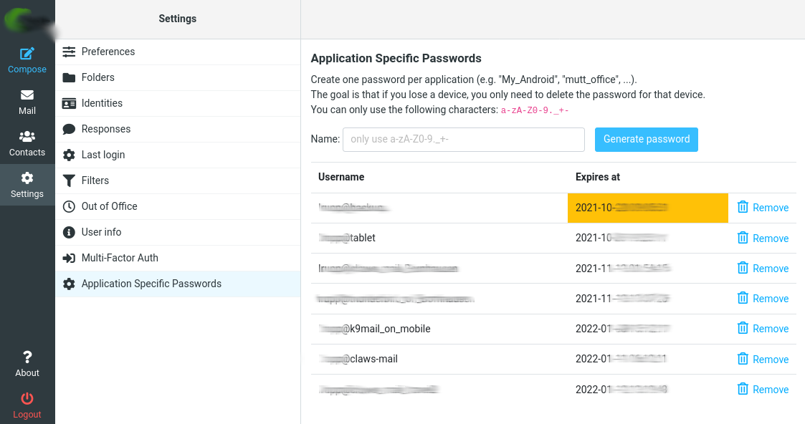

# Application Passwords Plugin for Roundcube webmail

Setting up Multi-Factor authentication (MFA) is an important step to secure your
Account. But you may run into issues if you use applications or older devices
that don't support Multi-Factory authentication (yet).

Application passwords provide temporary help here: an application password is a
long, randomly generated password that you provide only once instead of your
regular Multi-Factory authentication when signing in to an app or device that
doesn't support the new MFA verification.

This Roundcube plugin allows the creation of application passwords, together
with specific application-user-names. This makes it easy to identify the app or
device, which is using this kind of credentials to log-in to your service. In case 
a device get's lost or stolen, it's enough to remove just the generated authentication 
data for this single device.

The plugin allows to enter a specific application-user-name and generates 
a random password for this specific login. Once generated, users can just click 
on the password string to get it copied to the clipboard of a device. A user 
now just has to reconfigure the Email application to use the specific 
application-user-name and the generated password. 



This plugin was heavily inspired by the code from kolab's 2FA plugin.


## Installation

#### Install with composer

Add the plugin to your `composer.json` file:

    "require": {
        (...)
        "openSUSE/ap4rc": "*"
    }

Run:

    $ composer update [--your-options]`

#### Manual installation

Place this directory under your Rouncdube `plugins/` folder.

Then, you need to import the database script:

##### MySQL/MariaDB
```
mysql -your_mysql_connection_options your_roundcube_database_name < SQL/ap4rc.mysql.sql
```

##### PostgreSQL
```
psql -your_postgresql_connection_options your_roundcube_databas_name < SQL/ap4rc.pgsql.sql
```

##### SQLite
Log in to your sqliteDB and read the file:
```
sqlite> .read SQL/ap4rc.sqlite.sql
```

NOTE: You are welcome to contribute with other database drivers.


### Configure and enable the plugin

Copy `config.inc.php.dist` to `config.inc.php` and modify it as necessary.
Alternatively, you can also include changed settings in the main Roundcube configuration file `config/config.inc.php`.

Don't forget to enable the lastlogin plugin within the main Roundcube configuration file `config/config.inc.php`.


## Settings:

### Intervals

Intervals are using the SQL syntax. So if you want to have a password expire in
2 months and get a warning 1 week before:

```php
$config['ap4rc_expire_interval'] = "2 MONTH";
$config['ap4rc_warning_interval'] = "1 WEEK";
```

`ap4rc_expire_interval`

How long an application password should be valid
Default: `2 MONTH`

`ap4rc_warning_interval`

The interval before the expiry date is reached that the roundcube webui
will warn you about expiring password:

Default: `1 WEEK`

### Other settings

`ap4rc_generated_password_length`

How long should generated passwords be?

Default: `64`

`ap4rc_application_name_characters`

Which characters are allowed in an application name.

Default: `a-zA-Z0-9._+-`

`application_password_characters`

Which characters are used to generate passwords.

Default: `0123456789abcdefghijklmnopqrstuvwxyzABCDEFGHIJKLMNOPQRSTUVWXYZ.,!?(){}[]/*^+%@-`


## Dovecot side of things

### Prequisists

It is important that the auth userformat is `%u` and not just `%n`.

### SQL Query
The proposed SQL Query configuration

The interval at the end should match the ap4rc_expire_interval to get a consistent behavior.

#### PostgreSQL

```
password_query = SELECT username,password FROM application_passwords WHERE username='%u' AND application='%d' AND created >= NOW() - INTERVAL '2 MONTH';
```

#### MariaDB/MySQL

```
password_query = SELECT username,password FROM application_passwords WHERE username='%u' AND application='%d' AND created >= NOW() - INTERVAL 2 MONTH;
```

## Expiry of passwords

As Mail protocols are not really supporting nice ways to do MFA, we decided to limit the time to live of passwords.
If you do not wish to have your passwords expire you can take 2 steps:

1. remove the `AND created ...` part from the Dovecot query
2. set a very long expiry time in your roundcube config:

```php
$config['ap4rc_expire_interval'] = "100 YEAR";
$config['ap4rc_warning_interval'] = "1 YEAR";
```

That way your passwords will never expire and the webui will not annoy you with popups.

# License
Copyright (C) 2021 SUSE LLC

This program is free software: you can redistribute it and/or modify
it under the terms of the GNU Affero General Public License as
published by the Free Software Foundation, either version 3 of the
License, or (at your option) any later version.

This program is distributed in the hope that it will be useful,
but WITHOUT ANY WARRANTY; without even the implied warranty of
MERCHANTABILITY or FITNESS FOR A PARTICULAR PURPOSE. See the
GNU Affero General Public License for more details.

You should have received a copy of the GNU Affero General Public License
along with this program. If not, see <http://www.gnu.org/licenses/>.

